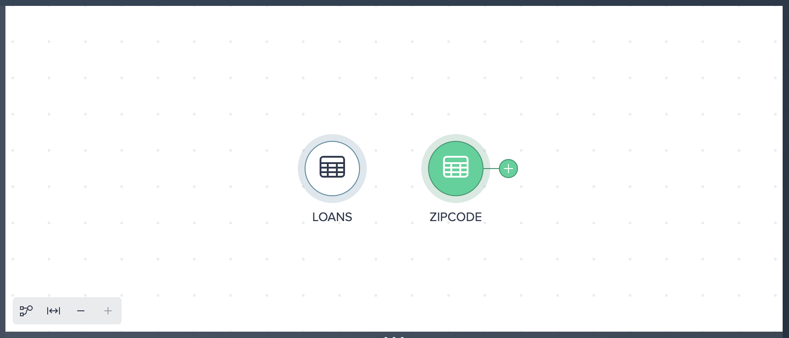
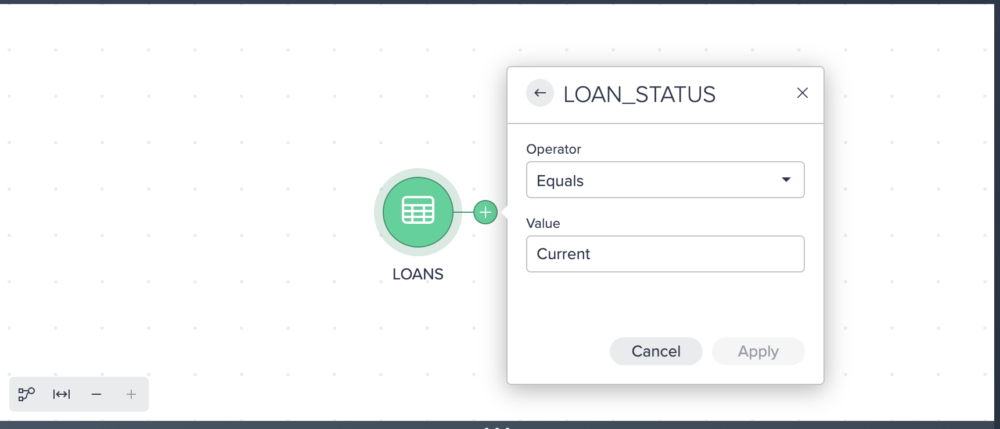
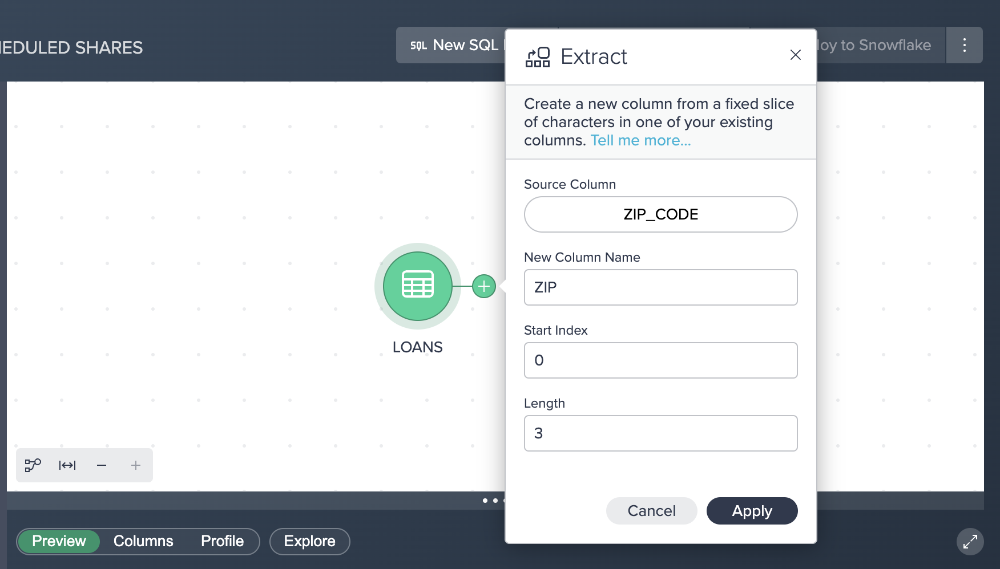
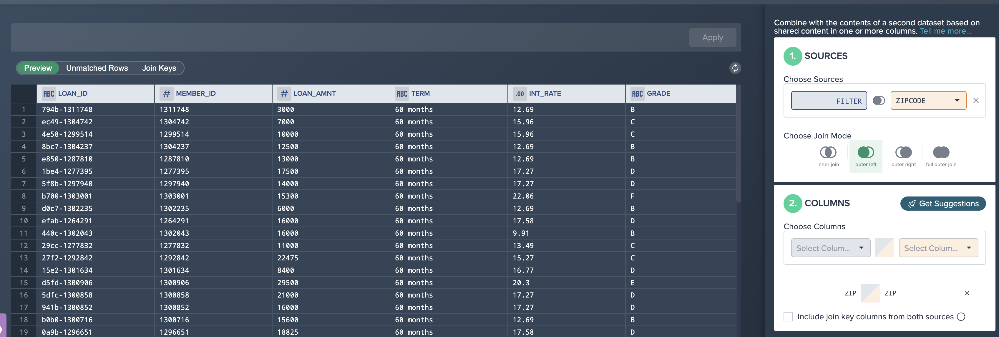
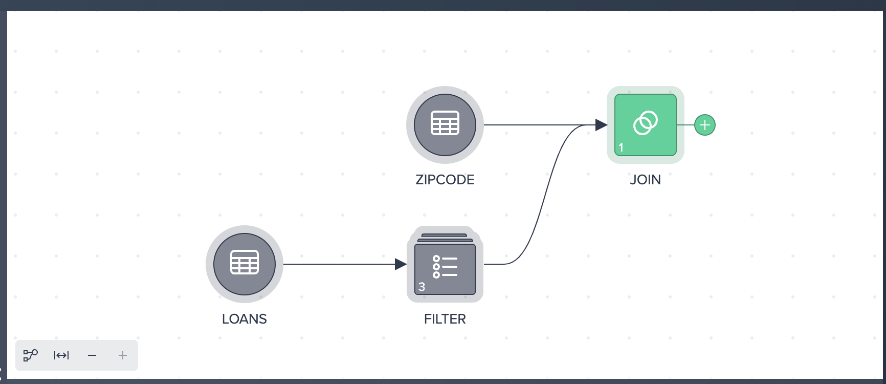
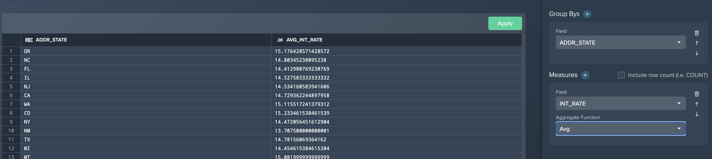
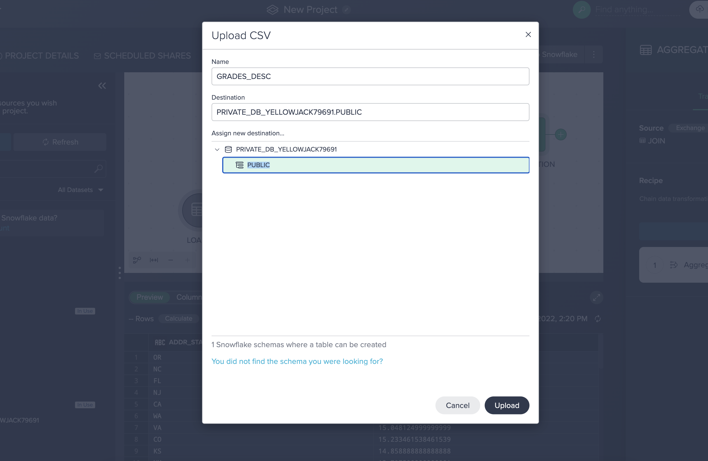
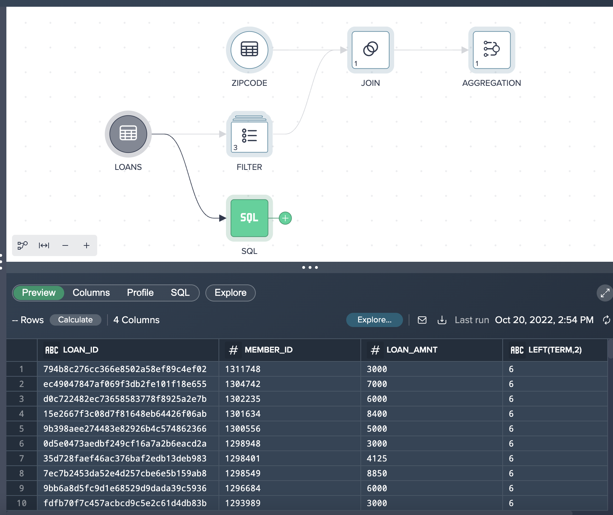

### **1. Overview**

Datameer provides users with data discovery & transformation capabilities to visually explore and transform their data to identify the key insights for improving data driven decisions. Users can transform their data using a variety of no-code, low-code and SQL transformation recipes and then quickly publish this data back into Snowflake to support the development of BI dashboards, reports and data science driven insights in your organization. All this can be delivered without the need for IT assistance or formal training and without leaving a single user interface.  
\
\

\
\
\
\
In this training lab you will learn how to model and transform your data, create highly valuable datasets, and publish the data into Snowflake. No coding skills are necessary using our no-code tools or writing code using our SQL toolset. Or even use both! We will provide you with a test Datameer & Snowflake instance for this hands-on lab.

Lab Overview

This entry-level lab introduces you to the user interface and basic capabilities of Datameer. When done with the lab you should be ready to create your own data transformations against your own Snowflake data.

Target Audience

Anyone who will be exploring & transforming data in Snowflake. Includes technical roles like members of an Analytics & BI team, data engineers to non-technical business users in the various lines of business. No SQL or technical skills are needed to do this lab.

What you'll learn

In this workshop lab, you will experience the following capabilities in Datameer: 

* Search and discover your Snowflake inventory
* Prepare and curate your data sets
* Explore and analyze your data sets 
* Share and deploy your data sets 
* Document and catalog your new datasets

**Business Use Case for this Hands On Lab (HOL)**

For the purposes of this workshop, you play the role of a loans analyst. Throughout this lab we will be working with some current and historical loans data from our fictitious loans company. We will begin with looking at our current loans data only, but throughout the course of the lab will incorporate some geographical information to transform & understand our loan portfolio by state/region being able to spot business opportunities in these regions.

### **2. Preparing the lab environment**

Click the link below to get to the trial setup:

[Datameer Trial](https://www.datameer.com/trial)

\

The first time you login to Datameer you will be taken directly to a project. We will begin exploring and transforming data in the next module. 
\
\

### **3. Data Exploration**

Let’s add our first data source by clicking the plus sign next to the LOANS table. This will add the table to our workspace for discovery and transformation. 

We can explore this dataset in three different ways:

* Preview - Under the preview tab you can see the actual data values and total number of records.  Datameer also utilizes Snowflake’s native sampling when transforming large tables. This will be indicated in the preview tab with the ‘Sampled’ label.
* Columns - This tab contains the column names, data types, and descriptions.
* Profile - You can view column metrics within this tab, by clicking on the calculate button for the desired column.  Click on the calculate button for the ‘GRADE’ column, and you can see the number of values, empty values, uniques, nulls, and the distribution of values. 

Let’s now add another dataset to project - this time by adding the ZIPCODE dataset by selecting the + icon next to the table. You should see this workspace:

### 4. No code transformations

Select the GREEN + icon next to the LOANS dataset to bring up the list of no code transformations

\

Let’s apply a filter by doing the following:

* Click filter in the popup context menu
* Select LOAN_STATUS as the column to filter by
* Leave equals as the operator
* Enter Current (case sensitive) as the value to search by
* Click apply

Here we can see a FILTER condition in the UI with a RECIPE step on the right hand side. You may see another purple hint appear on the screen informing you that you have created your first RECIPE.

Let’s apply another transformation. The EXTRACT option allows us to EXTRACT a certain number of characters from one field to a new column name. In our example we want to EXTRACT the first 3 digits from our ZIP_CODE column and populate this in a new column name called ZIP.  (Please note we use an INDEX value starting at 0 and extract 3 characters from this position to get the first 3 characters from this column)  

Here are the steps for an extract:

* Click the plus sign next to the filter node and select ‘Extract’
* Select ZIP_CODE for the source column
* Enter ZIP for the new column name
* Enter 0 for a start index and 3 for length
* Click apply

You should now see the following flow:

### **5. Low code transformations** 

The formula builder can be used to enter low code formulas on a columnar basis. All functions can be found on the right hand side, grouped together by different categories (STRING, NUMERIC, DATE & TIME, CONVERSION, CONTEXT & CONDITIONAL) - selecting a category allows you to browse the Snowflake functions functions and obtain help on how to use these against your data. Inside the FORMULA BUILDER we can select a field to transform using a variety of functions or we can select the GREEN + icon to add a new column.  

Let’s apply a formula to concatenate the first 4 characters from the LOAD_ID column with the MEMBER_ID column and put a ‘-’ separator between the two values:

* Click on the + sign next to the EXTRACT node, and select the formula builder option
* Select the LOAN_ID column
* Enter the following formula:

CONCAT(LEFT(Source.LOAN_ID,4),'-',MEMBER_ID)

* Click ‘Apply formula’ to validate the formula, and then ‘Apply’ 

 

Formula editor view:

### **6. Joining data together**

The third RECIPE step is complete and now we want to JOIN our LOANS data with our ZIPCODE (POSTCODE) dataset. Let’s apply a join:

* Click the plus sign next to the Formula node and select Join
* Select the ZipCode dataset in the orange box
* Click ‘Get suggestions’
* Select the Zip-Zip suggestion
* Click the green apply button

Join configuration:

The resultant flow:

### **7. Exploring the data**

Datameer provides functionality to perform exploration of datasets through dimensions and measures without having to export to a BI tool. For example, to calculate the average interest rate by loan grade and purpose, perform the following steps:

* Click the ‘JOIN’ node
* Click Explore
* Click Aggregate
* Choose ’GRADE’ for the dimension column
* Add a second dimension, ‘PURPOSE’
* For Measure, choose INT_RATE
* For function, select AVERAGE
* Click OK

You will then see the aggregated results, which are always calculated based on the full data set. Additionally users can filter and sort the explorations.  The explorations are tied to the nodes, and can be retrieved by clicking on the saved ‘explore’ tab. Currently the explorations are saved in the browsers cache, with future plans to persist them as nodes, as well as to provide visual exploration. You can also visualize the results by clicking on the bar chart icon. 

### **8. Aggregating data**

Users can create persistent aggregation and pivot nodes. For example, we can create an aggregation of the interest rate by the state:  

* Click the + sign next to the JOIN icon and select AGGREGATE
* Select ADDR_STATE for the ‘Group By’ field
* Select INT_RATE for the measure
* Select AVERAGE for the function
* Click the green ‘Apply’ button

Aggregate configuration:

The updated pipeline flow:

### **9. Deploying assets**

We now want to DEPLOY our newly transformed JOINED and AGGREGATED data back into Snowflake:

* Select the AGGREGATION node and click DEPLOY TO SNOWFLAKE
* Select the TABLE option
* Name the table LOAN_AGGREGATION
* Select the PUBLIC schema under PRIVATE_DB_<DB_NAME>
* Select ‘Deploy Data’

Your transformations are now deployed to Snowflake as a table !

### **10. File uploads**

Users can upload files through Datameer which are then materialized as Snowflake tables. You can download a sample CSV file [here](https://datameer.box.com/s/0wfvv4gue31ng2311c81i6fq8lzivfzk).

To upload a file, perform the following:

* Click ‘Upload CSV’
* Drag loans.csv into the upload window (or browse to the file)
* Name the new table LOAN_GRADES
* Select the PUBLIC schema under PRIVATE_DB_<DB_NAME>
* Click Upload

The file is now materialized as a table.

### **11. SQL Transformations**

Users can also add SQL nodes as part of the overall transformation process.  SQL nodes can be combined with no or low code nodes. We can try the following to insert a SQL node into our pipeline:

* Click the LOANS node
* Click ‘New SQL Editor’
* Enter the following SQL:

        select LOAN_ID, MEMBER_ID, LOAN_AMNT, LEFT(TERM,2) from LOANS where LOAN_AMNT < 10000 and LOAN_STATUS = 'Current'

* Click ‘Apply’

You can now see the SQL node in your project workspace:

### **Conclusion and Next Steps**

Summary

This training was designed to be an introduction in how to use Datameer for data transformation geared towards a business user or analyst. Through this lab we have walked through how the Datameer project workbench enables us to quickly explore & transform Snowflake data in a self-service manner using a no-code, low-code and SQL based approach. Because Datameer is SaaS and pushes all queries to Snowflake for execution, Datameer can combine its user interface and the unlimited power of Snowflake to give users a quick & easy way to transform your data, but with no limit on the amount of data you wish to analyze. Unlock the value of all your data and users!

Still have questions?

We're happy to help with whatever questions you have! Reach out to us using our support address at support@datameer.com

Other Resources

Documentation: 		         [https://documentation.datameer.com/datameer/](https://documentation.datameer.com/datameer/) 

Knowledge Base:		         [https://help.datameer.com/hc/en-us](https://help.datameer.com/hc/en-us)

Datameer Blog: ​		         [https://www.datameer.com/blog/](https://www.datameer.com/blog/) 

Resources/Case Studies:         [https://www.datameer.com/resources/](https://www.datameer.com/resources/) 
